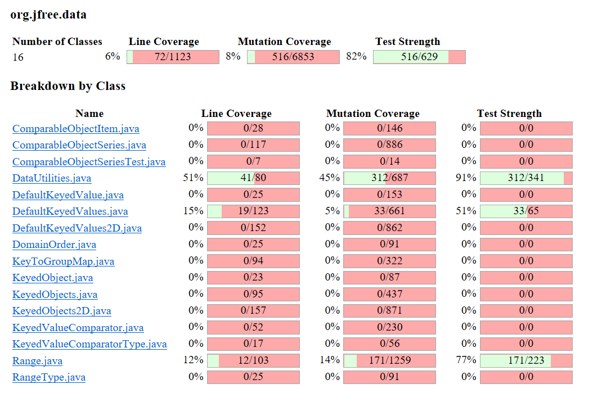

**SENG 438 - Software Testing, Reliability, and Quality**

**Lab. Report \#4 – Mutation Testing and Web app testing**

| Group \#:      |  9                 |
| -------------- | ------------------ |
| Student Names: |  Christina Wyllie  |
|                |  Sobia Khan        |
|                |  Maitry Rohit      |
|                |  Jamie Stade       |

# Introduction
This lab covers PIT mutation testing and GUI testing. The first part we used Pitest in Eclipse to create mutants and test if these were caught and killed by the test suites we wrote for assignment 3. We also worked to improve this test suite in order to catch more mutants. The second part was the GUI testing where we used Selenium IDE, a GUI testing software to test the GUI of IKEA. We wrote automated scripted tests which the software executed and and compared this to another GUI testing software Sikulix.

# Analysis of 10 Mutants of the Range class 
**1. contains():** remove condition - replace conditional check with false (KILLED) 
This mutation replaced the condition on line 144: return (value >= this.lower && value <= this.upper); to false when it was true for the input provided, and the test, rangeContainsValueInRange() expected true to be returned, but instead false was returned, so it caught this mutation thus killing it. 

**2. intersects():** Decremented (--a) double field lower (KILLED) 
This mutation takes the value of the varibale 'lower' on line 157 and decrements it by 1. For example if the value were 2 it would be decremented to 1. This mutant is taken care of by intersectIsRange() test which tests the range (-5.0, 5.0) against the values (-5, 5) so when lower is decremented, the test captures this and kills the mutant.

**3. getLength():** Incremented (a++) double field upper (SURVIVED) 
This mutation takes the value of the variable upper on line 123 and post-increments the value after using it. For example if the value of upper was 1, the value would be changed to 2 after using it. The tests do not catch this since the value is only incremented after use, so it survived. 

**4. getUpperBound():** Negated double field upper (KILLED)
This mutation replaces the value of 'upper' with the negative version of that number on line 114: return this.upper; This mutation is caught by the test upperBoundRange() because it expects 1 to be returned but the negative equivalent, -1, was instead returned and the test caught this and killed the mutation.

**5. getLowerBound():** Incremented (a++) double field lower (SURVIVED)
This mutation takes the value of the variable lower on line 105 and post-increments the value after using it. For example if the value of lower was 0, the value would be changed to 1 after the statement is executed. The tests do not catch this since the value is only incremented after use, so it survived. 

**6. intersects():** Negated double field lower (killed)
This mutation takes the value lower on line 157 and negates it. The initialized original range is from -5-5. By negating the lower bound value the range becomes 5-5. The test intersectWithinRange catches this mutation because the range passed in is -4.99-4.99 and should return true. However, because the mutation changed the range to 5-5, -4.99-4.99 no longer returns true.

**7. contains():** replaced boolean return with true (KILLED)
This mutation replaces the return value on line 144 in the function returns from something calcuated by the program with "true". This mutation is caught by rangeContainsPastLowerBound() because that test sends in a value that should have the function originally return false. When the mutation returns true this test will fail.

**8. contains():** negated double field lower (KILLED)
This mutation causes the variable lower on line 144 to be be negated. For example, if the value is -5 than it will be negated to 5. This mutation is caught by the test rangeContainsLowerBound(). The range set in the test is from -1 to 1. Therefore, negating lower bound means the range is from 1 to 1. However by testing if the true lower bound is contained (-1) we catch this because it will no longer return true with the mutation.

**9. intersects():** Incremented (a++) double local variable 1 (SURVIVED)
This mutation occurs by munipulating the local variable b0 on line 161 and incrementing the value. The test survived because the post incrementation only occurs after the if condition is computated. This means the mutation has no effect on the program and could be considered an equivalent mutation. Therefore, the mutation survives.\ 

**10. getLowerBound():** Replaced double return with 0.0d (KILLED)
This mutation takes the function getLowerBound() and munipulates the precision of this.lower to be 0.0d on line 105. This is caught by both the lower bound tests because they have a specified precision of .000000001d. 0.0d would not be as accurate, thus the mutation gets killed.

# Report all the statistics and the mutation score for each test class
## Range/DataUtilities Tests Original
<!--   -->

## Range Tests Updated

## DataUtilties Tests Updated

# Analysis drawn on the effectiveness of each of the test classes

## Data Utilities:

Data Utilities had an original mutation coverage of 45% and the new score going up 68%. This is an increase in 23% effectiveness. This means that the newly added tests were more effective at killing the mutants which our previous test suite did not. This was improved by adding tests for methods which were not originally covered.

## Range:

Range had a much lower mutation coverage to begin with, 14%, being less effective than the original Data Utilities coverage. This is due to less methods being covered in the test suite. The coverage was increased to 24%, giving an increase of 10%, by adding tests for two new methods which were not originally covered and improving the tests for methods that were covered. 

# A discussion on the effect of equivalent mutants on mutation score accuracy
Equivalent mutants are mutants that logically the same as the source code. When this occurs, a mutation is registered as "survived" because it preforms in the same way the original test code preforms, so the mutation makes no impact to improving the test code. Mutation equivalents actually hurt the mutation score accuracy because they lower the score and there is no logical test that would "kill" the mutation. If the orignal program fails a test a mutation equivalent will fail that same test (same goes for if it passes). Mutation equivalents are overall unhelpful and harm the testing process. 

The process of finding an equivalent mutation:
1. Find all the mutations that are registered as "survived"
2. Apply that supposed mutation to the line 
3. Analyze possible inputs or logically walk through the process of that line to determine whether or not it's possible to conduct a test that would kill the mutation
4. If there is no logical test that would kill the mutation an equivalent mutant has been found

Examples of equivalent mutants: 
Line 265 DataUtilties.getCumulativePercentates(): Less than to not equal
- This is a for loop break condition. The program will reach the same break condition whether its less than or its equal to
- Note: Similar mutations occur for lines 177, 178, 227, and 245 for dataUtilities

Line 130 DataUtilties.calculateColumnTotal(): Incremented/decremented (a--/a++) on local variable
- A post increment or decrement to variables can be considered equivalent mutations if they are local variables that are never used again within the function. The new value that it is post-incremented/decremented to has no effect on any other data. 
- Note: Similar mutations occur all through DataUtilties on lines 133 and 181.

# A discussion of how you improved the mutation score of the test suites. Your design strategy.
For Range.java and DataUtilities.java, the mutation coverage was low because only 5 methods in each class were covered in the previous assignment therefore, the mutants for methods which had not been covered survived. To improve this, the team examined the PIT Mutation Summary from the original test suite and the lines which still had mutants which survived (highlighted in red), for the methods which were covered. We worked first on writing new tests for the methods which had already been covered and developed the following tests to kill mutants:
- intersectEqualValues(): This test tests for when the input values to intersect() are the same value (-5.0) and the range being tested against is (-5.0, 5.0) to kill the mutant "changed conditional boundary"
- testContainsWithSmallRangeLowerBound(): This tests the contains() method when the range is smaller and the value is right on the lower bound of the range. This killed any mutants which swapped the input value with a negative which was previously not tested since the ranges were larger and the negative equivalent of the provided value was still contained in the range. The provided range was (0.5, 1) and the value inputted was 0.5, so when the mutant changed this value to -0.5, it was caught and therefore killed.
- testConstrainOutsideRangeLowerBound(): This tests the contains() method when the range is smaller and the value is below the lower bound of the range. This killed any mutants same as the last one, however, with a value outside of the range. The provided range was (-1, 1) and the value inputted was -2, so when the mutant changed this value to 2, it was caught and killed.
- testConstrainOutsideRangeUpperBound(): This tests the contains() method when the range is smaller and the value is above the upper bound of the range. This killed any mutants with as the last one, however, with a value outside of the range. The provided range was (-1, 1) and the value inputted was 2, so when the mutant changed this value to -2, it was caught and killed.\
\
\
After testing already covered methods, the team moved onto methods which were not yet covered.

- testRangeInvalidInput(): Test the Range constructor when the lower bound is greater than the upper bound. The values provided to the range constructor were (1, -1). This killed any mutants which tested this constructor that had previously not been touched.
- testCentralValueValidInput(): This method tests the getCentralValue() method. It provides valid input, using the range (-1, 1). This method kills mutants associated with this method which has not been previously tested.
- testConstrainOutsideRangeLowerBound(): This tests the method constrain(). The values provided were a range (-1, 1) and the value -2 into the method. This test covers any mutants on the lower bound side of this function which was not previously tested.
- testConstrainOutsideRangeUpperBound(): This tests the method constrain(). The values provided were a range (-1, 1) and the value 2 into the method. This test covers any mutants on the upper bound side of this function which was not previously tested.
- testCombineOverlappingNoNullsLowerRange: This tests the method combines() which was not covered in the original test suite. The values provided were two ranges: (-5.0, 5.0) and (-1.0, 1.0) and tests the lower bound of the two combined ranges. This kills any mutants associated to the lower bound of this combination.
- testCombineOverlappingNoNullsUpperRange(): This tests the method combines(). The values provided were two ranges: (-5.0, 5.0) and (-1.0, 1.0) and tests the upper bound of the two combined ranges. This kills any mutants associated to the upper bound of this combination.
- testCombineNullFirstRangeLowerBound(): This tests the method combines(). The values provided were two ranges: null and (-1.0, 1.0) and tests the lower bound of the two combined ranges. This kills any mutants associated to the lower bound of this combination with a null.
- testCombineNullFirstRangeUpperBound(): This tests the method combines(). The values provided were two ranges: null and (-1.0, 1.0) and tests the upper bound of the two combined ranges. This kills any mutants associated to the upper bound of this combination with a null.
- testCombineNullSecondRangeLowerBound(): This tests the method combines(). The values provided were two ranges: (-5.0, 5.0) and null and tests the lower bound of the two combined ranges. This kills any mutants associated to the lower bound of this combination with a null.
- testCombineNullSecondRangeUpperBound(): This tests the method combines(). The values provided were two ranges: (-5.0, 5.0) and null and tests the upper bound of the two combined ranges. This kills any mutants associated to the upper bound of this combination with a null.

Together, these tests increased the mutation coverage by 10%, from 14% to 24%.

/
/
Originally, there were only 5 methods covered in dataUtilties. Most of the mutants that survived ended up being logically impossible to catch or they were equivalent mutants. However, there were some tests that were created to improve on our original test suite. 

- columnNull()
- rowNull() 
- numberArrayNull() 
- numberArrayNull2D() 

All the above tests check the the line ParamChecks.nullNotPermitted(data, "data"); in their respective functions and expect an IllegalArgumentException to be thrown

After testing already covered methods, the team moved onto methods which were not yet covered. To improve the overall mutation score the team decided to test the DataUtilties.clone() and the DataUtilties.equals() methods. 

The following tests cover DataUtilities.equals():
- EqualArraysTest(): When 2 arrays are equal the function successfully returns true.
- ArrayAisNullTest(): When the first out of the 2 arrays is null the function returns false.
- ArrayBisNullTest(): When the second out of the 2 arrays is null the function returns false.
- BothArrayNull(): When both arrays are null the function returns true
- ArrayLengthisNotEqual(): When the length of array 1 is different from the length of array2 the function returns false.
- ArrayLengthisEqualArrayNotEqual(): When the lengths of both arrays are equal but the values inside are not equal to eachother the function returns false.

The following tests cover DataUtilties.clone():
- cloneNull(): A null value is passed in which cannot be cloned. This results in the IllegalArgumentException being thrown. 
- cloneCreated(): A valid array is passed in and the function successfully produces a clone.
- firstIndexNull(): The array passed in has a null index which the function registereds and clones properly.

Together these tests increased the mutation coverage from 45% to 68%.

# Why do we need mutation testing? Advantages and disadvantages of mutation testing
Mutation testing is unique because it both verfies the quality of the source code and the test suite itself. By creating mutants, the program can find weak test cases that could be improved on to kill mutants and PITest provides the exact mutants that were tested so that developers know exactly where to check and improve test cases. Additonally, mutation testing improves coverage of the code naturally; the more mutants that are discovered and killed by test cases the more likely it is those test cases increase the coverage of the overall program in a meaningful way. Tests that failed can be analyzed and defects in the source code itself may be found. Logical errors may also be found through mutation testing. 

Unfortunately, mutation testing is very costly and it takes time to produce a massive amount of mutants. For example, the PITtest program had to run for several minutes just to analyze 2 test classes. If a test suite were to be created for the entirety of JFreeChart it would take a significant amount of time to compute mutants. Mutation testing is also hard to understand and use for those unfamiliar with the method and the automated program being used. Extracting information from mutation test results is useful, but it can take a while to learn what the mutation test is attempting to check and how a developer may go about fixing that. Using PITtest was a difficult time consuming process at first. 

# Explain your SELENUIM test case design process
We started designing our test cases by first becoming familier with the website we chose to do our GUI testing on, which was IKEA. From there we determined which functionalities of the website would need testing in a real life application. We found that these were mainly functionalities which took user input, expecially if that user input needed to be formatted in a certain way, such as a postal code. 

## Eight Functionalities to Test on IKEA.com
1. User Login
    - Insert Invalid username - not email or phone number
    - Insert Valid username (email) but incorrect password
2. Sign Up for an Account
    - Sign Up valid credentials
    - Sign Up invalid address
    - Sign Up invalid password
3. Changing Postal Code
    - Insert Invalid Postal Code 
        - Ex. (9A909
    - Insert Valid Postal Code  
4. Adding an item to Cart
    - Add an Item in stock to cart
    - Add an item not in stock to cart
5. Adding an item to Shopping list
    - Add an Item in stock to shopping list
    - Add an item not in stock to shopping list
    - Add and remove item from shopping list
6. Search Bar
    - Search with invalid input 
        - Ex. nassdjkasldkjslad (Gibberish)
    - Search with valid input ie. item that exists in IKEA catalogue
    - Search with valid input that does not exist in IKEA catalogue
7. Rate/Review a product
    - Submit Review While logged in
    - Submit Review without logging in
8. Change Language on site
    - Change English to French
    - Change French to English

# Explain the use of assertions and checkpoints
Assertions in selenium are commands that allow you to check if the program is working correctly. The three types of assertions in selenium are "assert", "verify", and "waitFor." Assert commands will stop the test if the specified condition is not true, continue running the test if the condition is true. Verify commands are similar, except they will not stop running the test if the condition is false, instead only displaying an error message in the terminal. WaitFor commands will stall the test until a specified condition becomes true. If the specified condition does not become true within the timeout period, the test will stop running. 
Selenium checkpoints are very important to make sure that the right version of the web page is being tested. Common checkpoints include testing the page title, the url, page text, or any elements on the page that are unchanged.

# How did you test each functionaity with different test data
We chose to test each functionality with data a real user may pass in. So when searching for an item, a user could possibly search for an object which IKEA does not sell, such as an iphone, to make sure that the search engine could handle this properly and would not break in case of no matches being found. So we tested with invalid input. More important was testing with valid input. Searching for a product that does exist in the IKEA catalogue should result in the item showing up in the search results, preferably in the top results. Testing with valid input ensures that user experience with the application is good and users will return to use it. We tested to make sure invalid input resulted in an appropriate error message about why the input was invalid and the user could continue using the applicaiton. With valid input we tested that the exoected results were shown and tne user could continue using the application from that point. 

# Discuss advantages and disadvantages of Selenium vs. Sikulix
SikuliX is another tool used for scripted UI testing. The main difference between SikuliX and Selenium is that it uses screenshots to automate inputs, whereas Selenium tracks and records a user’s input on the program. From our experience, the screenshot recognition in SikuliX is accurate and reliable, whereas Selenium stalls on commands quite often, and is sometimes unable to find GUI components. However, scripting in Selenium is a lot quicker and efficient because commands are generated automatically from user inputs, whereas SikuliX requires the user to manually write commands.

# How the team work/effort was divided and managed
Every member participated in writing test cases and improving the mutation test score in addition to writing test cases for GUI component of this assignment. Tina, Sobia, and Maitry primarily focused on analyzing mutants while Jamie worked on writing test cases and getting the GUI testing prepared so that other members could later reference that work. The lab document was evenly divided into sections such that each member wrote 2-4 sections based on the complexity of the section. The team met out of lab time to compile lab work and discuss the tests made and how they contributed to the test suite.  

# Difficulties encountered, challenges overcome, and lessons learned
While setting up the lab, we faced challenges learning how the PIT Mutation testing works and how we could get the report to be produced. We figured out we had to import the library files from the previous assignments and had to wait a significant amount of time between running the PIT Mutation tests and receiving the PIT Summary. In addition, it was difficult to understand exactly what the mutants meant, given this was our first time seeing these messages. We were able to understand the messages after spending some time looking them up and were able to improve the coverages with the help of the mutation messages. We learned how to use mutation coverage and understand the meaning of the mutants. We found Selenium to be very unreliable when writing GUI tests. When we recorded the inputs with Selenium, certain inputs would cause the application to crash or become unresponsive, and a lot of effort was taken to avoid these inputs in our test cases. Additionally, Selenium would sometimes be unable to find GUI elements, when running our test cases, leading to a test failure due to timeout.

# Comments/feedback on the lab itself
The hamcrest library was forgotten in the artifacts given for assignment 4. It would be appreciated if comments were given about how to write sections of the report like in previous assignments. Additionally, it would be helpful if images were provided for what the program looks like when it's computing mutations. 

For the selenium GUI testing it would be helpful if there were provided tutorial videos on how to use it and more clarification on some of the terms used in the marking rubric. We were very confused about what automatic verification meant.

