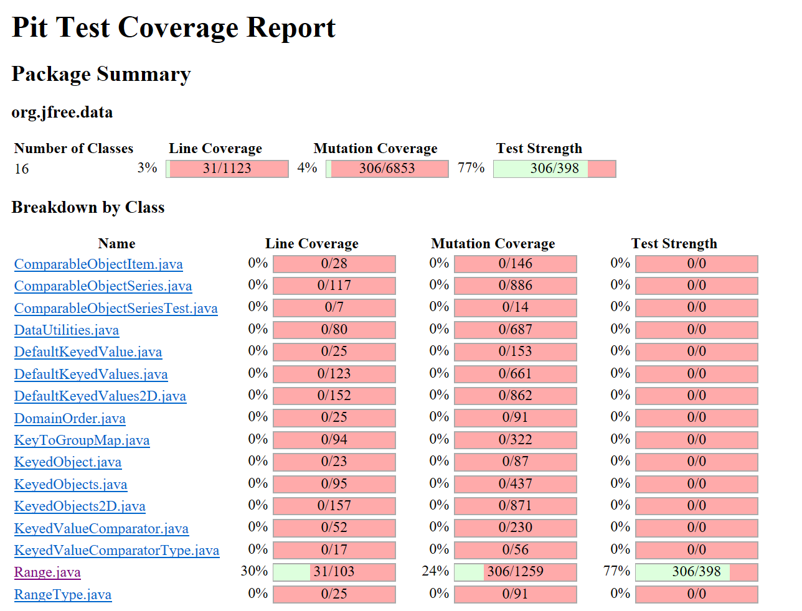

**SENG 438 - Software Testing, Reliability, and Quality**

**Lab. Report \#4 – Mutation Testing and Web app testing**

| Group \#:      |  9                 |
| -------------- | ------------------ |
| Student Names: |  Christina Wyllie  |
|                |  Sobia Khan        |
|                |  Maitry Rohit      |
|                |  Jamie Stade       |

# Introduction

# Analysis of 10 Mutants of the Range class 
**1. contains():** remove condition - replace conditional check with false (KILLED) 
This mutation replaced the condition on line 144: return (value >= this.lower && value <= this.upper); to false when it was true for the input provided, and the test, rangeContainsValueInRange() expected true to be returned, but instead false was returned, so it caught this mutation thus killing it. 
**2. intersects():** Decremented (--a) double field lower (KILLED) 
This mutation 
**3. getLength()123:** Incremented (a++) double field upper (SURVIVED) 
**4. getUpperBound():** Negated double field upper (KILLED) 
This mutation replaces the value of 'upper' with the negative version of that number on line 114: return this.upper; This mutation is caught by the test upperBoundRange() because it expects 1 to be returned but the negative equivalent, -1, was instead returned and the test caught this and killed the mutation.
**5. getLowerBound()105:** Incremented (a++) double field lower (SURVIVED) 
**6. intersects()157:** Negated double field lower (SURVIVED) 
**7. contains()144:** replaced boolean return with true (KILLED) 
**8. contains()144:** negated double field lower (KILLED) 
**9. getLenght()123:** negated douvle field upper (KILLED) 
**10. getLowerBound()105:** netgated double field lower (KILLED) 

# Report all the statistics and the mutation score for each test class
## Range/DataUtilities Tests Original
<!--   -->

## Range Tests Updated
!--   -->

# Analysis drawn on the effectiveness of each of the test classes
Tina

# A discussion on the effect of equivalent mutants on mutation score accuracy
Equivalent mutants are mutants that logically the same as the source code. When this occurs, a mutation is registered as "survived" because it preforms in the same way the original test code preforms, so the mutation makes no impact to improving the test code. Mutation equivalents actually hurt the mutation score accuracy because they lower the score and there is no logical test that would "kill" the mutation. If the orignal program fails a test a mutation equivalent will fail that same test (same goes for if it passes). Mutation equivalents are overall unhelpful and harm the testing process. 

The process of finding an equivalent mutation:
1. Find all the mutations that are registered as "survied"
2. Apply that supposed mutation to the line 
3. Analyze possible inputs or logically walk through the process of that line to determine whether or not it's possible to conduct a test that would kill the mutation
4. If there is no logical test that would kill the mutation an equivalent mutant has been found

Examples of equivalent mutants: 
Line 265 getCumulativePercentates(): Less than to not equal 
- This is a for loop break condition. The program will reach the same break condition whether its less than or its equal to
Note: Similar mutations occur for lines 177, 178, 227, and 245 for dataUtilities

# A discussion of what could have been done to improve the mutation score of the test suites
Tina

# Why do we need mutation testing? Advantages and disadvantages of mutation testing
Mutation testing is unique because it both verfies the quality of the source code and the test suite itself. By creating mutants, the program can find weak test cases that could be improved on to kill mutants and PITest provides the exact mutants that were tested so that developers know exactly where to check and improve test cases. Additonally, mutation testing improves coverage of the code naturally; the more mutants that are discovered and killed by test cases the more likely it is those test cases increase the coverage of the overall program in a meaningful way. Tests that failed can be analyzed and defects in the source code itself may be found. Logical errors may also be found through mutation testing. 

Unfortunately, mutation testing is very costly and it takes time to produce a massive amount of mutants. For example, the PITtest program had to run for several minutes just to analyze 2 test classes. If a test suite were to be created for the entirety of JFreeChart it would take a significant amount of time to compute mutants. Mutation testing is also hard to understand and use for those unfamiliar with the method and the automated program being used. Extracting information from mutation test results is useful, but it can take a while to learn what the mutation test is attempting to check and how a developer may go about fixing that. Using PITtest was a difficult time consuming process at first. 

# Explain your SELENUIM test case design process
We started designing our test cases by first becoming familier with the website we chose to do our GUI testing on which was IKEA. From there we determined which functionalities of the website would need testing in a real life application. We found that these were mainly functionalities which took user input, expecially if that user input needed to be formatted in a certain way, such as a postal code. 

## Eight Functionalities to Test on IKEA.com
1. User Login
- Insert Invalid username - not email or phone number
- Insert Valid username (email) but incorrect password
2. Changing Postal Code
- Insert Invalid Postal Code 
    - Ex. (9A909
- Insert Valid Postal Code  
3. Adding an item to Cart
- Add an Item in stock to cart
- Add an item not in stock to cart
4. Search Bar
- Search with invalid input 
    - Ex. nassdjkasldkjslad (Gibberish)
- Search with valid input ie. item that exists in IKEA catalogue
- Search with valid input that does not exist IKEA catalogue
5. 
6. 
7.
8. 

# Explain the use of assertions and checkpoints
Jamie

# How did you test each functionaity with different test data
Sobia

# Discuss advantages and disadvantages of Selenium vs. Sikulix
Jamie 

# How the team work/effort was divided and managed
Every member participated in writing test cases and improving the mutation test score in addition to writing test cases for GUI component of this assignment. Tina, Sobia, and Maitry primarily focused on analyzing mutants while Jamie worked on writing test cases and getting the GUI testing prepared so that other members could later reference that work. The lab document was evenly divided into sections such that each member wrote 2-4 sections based on the complexity of the section. The team met out of lab time to compile lab work and discuss the tests made and how they contributed to the test suite.  

# Difficulties encountered, challenges overcome, and lessons learned
While setting up the lab, we faced challenges learning how the PIT Mutation testing works and how we could get the report to be produced. We figured out we had to import the library files from the previous assignments and had to wait a significant amount of time between running the PIT Mutation tests and receiving the PIT Summary. ***********

# Comments/feedback on the lab itself
The hamcrest library was forgotten in the artifacts given for assignment 4. It would be appreciated if comments were given about how to write sections of the report like in previous assignments. Additionally, it would be helpful if images were provided for what the program looks like when it's computing mutations. 

For the selenium GUI testing it would be helpful if there were provided tutorial videos on how to use it and more clarification on some of the terms used in the marking rubric. We were very confused about what automatic verification meant.

